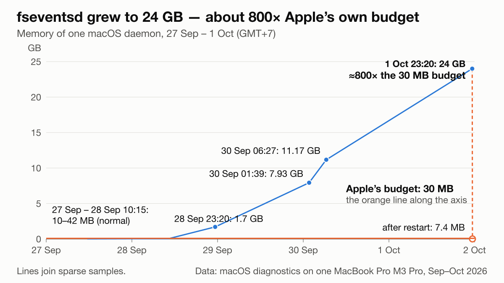
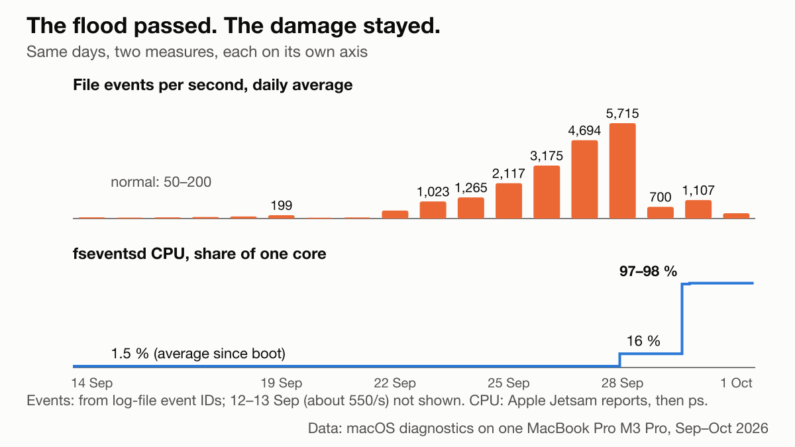
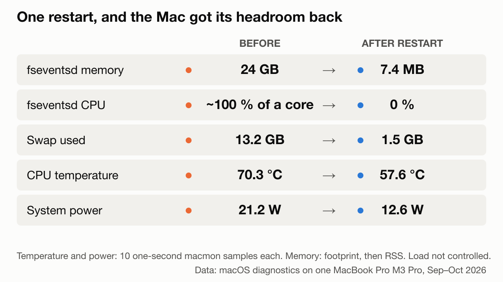
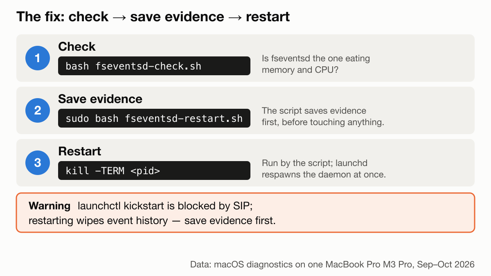

# fseventsd grew to 24 GB on my Mac, 800 times Apple's own budget, and never recovered on its own

How to spot it, why it stays stuck after the load is gone, and how to fix it without a reboot.

macOS's file-event daemon, `fseventsd`, grew to 24 GB on my MacBook Pro and kept one CPU core busy for two days. Apple's own memory budget for it is 30 MB. The burst of file activity that set it off was over by then; the daemon never came back down. I run many AI coding agents on this machine, so here is what I measured, what I could not prove, and a check you can run yourself. I call it a leak below; strictly, it is memory that only grew.

## TL;DR

- **Spot it.** `top -l 1 -stats pid,mem,cmprs,ports -pid $(pgrep -x fseventsd)`. A healthy daemon sits in single or low double-digit megabytes. Mine showed 24G, with 18G compressed.
- **Compare with Apple's budget.** `launchctl print system/com.apple.fseventsd | grep 'jetsam memory limit (active'` prints a soft limit of 30 MB. Jetsam is the macOS memory-limit enforcer; a soft limit is not enforced by killing the process.
- **Do not wait for it to heal.** The file-event flood subsided on 29 Sep. The daemon's CPU use went *up* afterwards, to 97–98 % of a core for two days.
- **Save evidence first.** `sudo ls -laT /System/Volumes/Data/.fseventsd` and `sudo sample $(pgrep -x fseventsd) 5`. A restart erases the event history.
- **Fix without a reboot.** `sudo kill -TERM $(pgrep -x fseventsd)`. launchd respawns it at once. `launchctl kickstart -k` is refused by SIP (System Integrity Protection, which shields Apple's services even from root).

## Quick start

```sh
curl -fsSLO https://raw.githubusercontent.com/talkstream/fseventsd-runaway/main/fseventsd-check.sh
less fseventsd-check.sh && bash fseventsd-check.sh
```

No sudo, changes nothing, prints `OK`, `WARN` or `RUNAWAY` (exit code 0, 1 or 2; 3 if it cannot measure), `--json` for scripts and `--fast` to skip the 5-second CPU sample. `fseventsd-restart.sh` saves evidence, restarts the daemon and measures again; it refuses to restart if it could not save the evidence. Read it before running it with sudo.

For Claude Code users there is a plugin that runs the same check, memory only and in well under a second, at every session start, and stays silent while the daemon is healthy:

```
/plugin marketplace add talkstream/fseventsd-runaway
/plugin install fseventsd-health@fseventsd-runaway
```

## 1. Symptom

The machine is a 14-inch MacBook Pro, M3 Pro, 18 GB, macOS 27.0 (26A428), up 20 days 19 hours. It runs heavy agentic development: Claude Code sessions with subagents, Node, pnpm, vitest, Playwright, Python hooks, MCP servers, Docker through Colima. A saved `top` snapshot showed:

- `fseventsd` at 121 % in `top` (several threads; `ps` showed 5 seconds of CPU per 5 seconds of wall time: one core, continuously), 57 hours of CPU time since boot.
- Swap at 13,548 MB of 14,336 MB.
- `mediaanalysisd` at 108 %, `kernel_task` at 65 % and `WindowServer` at 42 %: `fseventsd` was not the only busy process. Why `kernel_task` was busy, I do not know; Apple says it helps manage CPU temperature.

## 2. The suspect and Apple's own 30 MB budget

`fseventsd` tells apps what changed on disk and keeps a persistent per-volume history of those events.

`footprint` reported 24 GB for the process, all of it "Malloc Small" (the heap class for small objects) in 8,162 regions. `top` agreed: 24G memory, 18G of it compressed.

Apple states the daemon's budget in its launchd job:

```
$ launchctl print system/com.apple.fseventsd | grep 'jetsam memory limit (active'
jetsam memory limit (active, soft) = 30 MB
```

24 GB is about 800 times that. The limit is soft, so nothing acted on it.

## 3. Timeline: the load passed, the damage stayed

Apple's own reports in `/Library/Logs/DiagnosticReports` let me rebuild the growth. Memory figures are as the tools print them, in binary units; Jetsam reports count 16 KB pages.

| When (GMT+7) | fseventsd memory | Source |
|---|---|---|
| 27 Sep 11:29 to 28 Sep 07:59 | 10 to 42 MB (normal) | disk-writes report |
| 28 Sep 10:15 | 0.04 GB | Jetsam event |
| 28 Sep 23:20 | 1,745 to 1,834 MB (about 1.7 GB) in about 2 min | cpu_resource report |
| 30 Sep 01:39 | 7.93 GB, the largest process on the Mac | Jetsam event |
| 30 Sep 06:27 | 11.17 GB | Jetsam event |
| 1 Oct 23:20 | 24 GB | `footprint` |



The same reports record the daemon's CPU time, so I can compute what share of one core it used between them:

| Period | Share of one core |
|---|---|
| Boot (11 Sep) to 28 Sep 10:15 | 1.5 % |
| 28 Sep 10:15 to 30 Sep 01:39 | 16 % |
| 30 Sep 01:39 to 06:27 | 97 % |
| 30 Sep 06:27 to 1 Oct 23:00 | 98 % |

Now compare with the load. The history directory names each log file by a file-event ID, and the IDs only grow, so the gap between days gives events per day (`tools/events_per_day.py`). One exception: on 11 Sep, right after boot, the ID jumped by 4.7 billion in 11 minutes; that is a boot artefact, not events, so I leave that day out. On 14 to 21 Sep the Mac averaged about 50 to 200 events per second (12 and 13 Sep were higher, about 550 a second, and the daemon was still at 10 MB on 27 Sep; the boot day, 11 Sep, shows an ID jump, so the series starts after it). Then 479 on 22 Sep, 2,117 on 25 Sep, 4,694 on 27 Sep and **5,715 on 28 Sep**: about 494 million events in one day, roughly 1.6 billion over the week. On 29 Sep it fell to 700, on 30 Sep it was 1,107. When I measured on 1 Oct, `FSEventsGetCurrentEventId()` advanced 195 events per second.



So the burst subsided on 29 Sep, and the daemon got *more* expensive after it: it averaged 16 % of a core from 28 Sep 10:15 to 30 Sep 01:39 (the peak day and the day after; a macOS report caught it at 63 % on 28 Sep 23:20), then 97 to 98 % from 30 Sep 01:39 on, while events fell to 700–1,107 per second. Memory went from 42 MB to 7.9 GB in under two days and kept climbing to 24 GB. Here, a burst pushed `fseventsd` into a state it did not leave on its own in the 46 hours I could see. Only a restart reset it.

macOS noticed and did nothing. The 28 Sep report says "90 seconds cpu time over 143 seconds (63% cpu average), exceeding limit of 50% cpu over 180 seconds", then "Action taken: none". It also shows `ThermalPressure -> 0`: no thermal throttling.

## 4. What it was doing

Sampled as root (`sudo sample <pid> 5`), the daemon had 17 threads. The hottest is the one that writes events to the on-disk log, `com.apple.fseventsd.disklogger`: 2,351 of its 2,526 samples (93 %) were inside `_platform_strncmp`, plain string comparison. The thread that delivers events to apps spent about half its samples waiting on a mutex (1,358 of 2,526) and 169 in the same string compare. A thread serving `photolibraryd`, which had just asked for history, was reading old logs (`gzread`) and waiting on a mutex too, at a different call site; whether it is the same lock, `sample` cannot show.

The disk-logger and delivery threads sit in the same internal function, whose samples show three things: a mutex lock, a string-compare loop and a `malloc` call. My reading, and it is only a reading because the binary is stripped: a lookup-or-insert over path strings that keeps growing. If that structure only grows, every new event costs a little more than the last. That would fit all three numbers at once: 24 GB of small allocations, CPU share rising after the load fell, and one core pinned by about 200 events per second.

It held only 176 Mach ports (kernel handles for talking to other processes), with `lsmp -p <pid>`. So the 24 GB is not thousands of live clients; it looks like accumulated state. Another user saw the same with a 36 GB daemon and "only around 375 mach ports" ([daintree#12455](https://github.com/daintreehq/daintree/issues/12455)).

## 5. Where did the flood come from?

The honest answer: several things were running, and I cannot say which one made 494 million events a day. The direct evidence, which paths the events were for, was in the event history, and the restart erased it (section 6). Here is what I checked.

- **Agent activity.** I counted every Claude Code tool call per day in my local transcripts, all sessions and subagents, unique by call ID (`tools/count_tool_calls.py`). Against log files per day for 22 to 30 Sep, Pearson r = 0.71. Weak: agent activity was high on all nine days, and on 19 Sep 11,739 tool calls came with only 325 log files. Many of those calls were file reads and searches anyway.
- **Mutation testing.** Stryker and mutmut runs appear in my transcripts from 24 Sep (`tools/count_mutation_runs.py`): 63 on 24 Sep, 25 on 26 Sep, 50 on 27 Sep, 37 on 28 Sep, 33 on 30 Sep. 24 Sep had more runs than 27 Sep at a quarter of the event rate (1,265 against 4,694 per second). One Stryker run in one of my JS projects copies the project, 3,000 to 4,900 files depending on what it ignores, into a sandbox and deletes it afterwards. Copying the sandbox alone is thousands of file events per run, nowhere near hundreds of millions a day; what the hundreds of test runs inside each sandbox wrote, I did not count. The daily counts do not follow the flood, so it is a possible contributor, not a proven one.
- **Docker through Colima.** Colima mounted my whole home directory into the VM, writable, over virtiofs. That is the setup in [colima#1569](https://github.com/abiosoft/colima/issues/1569), where `fseventsd` reached 28 GB. But the current Colima VM was created on 26 Sep at 00:55, after the flood had started, and no local `docker` or `colima` command appears in my transcripts before that minute.

Whatever the trigger, a system daemon should not hold 24 GB, or stay pinned after the load is gone.

## 6. Fix without reboot

The documented route is refused:

```
$ sudo launchctl kickstart -k system/com.apple.fseventsd
Could not kickstart service "com.apple.fseventsd": 150: Operation not permitted while System Integrity Protection is engaged
```

`sudo kill -TERM <pid>` worked. launchd respawned it at once, because its job is marked KeepAlive: new process at 23:21:01, 7.4 MB, under 1 % CPU. Others report `sudo killall fseventsd` fixing the same symptom (see Sources).

The restart wiped the event history: 93,494 files became 2. The best question, which paths made the flood, can no longer be answered. **Collect evidence before you restart.** `FSEvents.h` defines `MustScanSubDirs`, `UserDropped` and `KernelDropped` flags that tell clients to rescan after lost events; what my apps did with them, I did not check.



Swap used fell from 13,548 MB (of 14,336) to 1,533 MB (of 3,072). I restarted the daemon a second time while testing the restart script, then logged ten minutes (23:31 to 23:41): `fseventsd` stayed at 5 to 6 MB and 0 % CPU, CPU temperature had a median of 54.8 °C, system power 10.0 W.



## 7. Did it hurt the hardware?

**SSD.** `smartctl -a disk0`: Percentage Used 2 %, Available Spare 100 %, Media errors 0, 75.7 TB written (147,957,613 data units of 1,000 × 512 bytes), 2,620 power-on hours. Percentage Used is the vendor's own estimate.

This boot wrote 8,012 GB, about 0.4 TB a day, and swap-outs were 4.2 TB of it: about half. Howard Oakley's rule: swap under 10 % of writes contributes little to wear, and "If it's 50% or higher, then having more physical memory would significantly reduce SSD wear" ([source](https://eclecticlight.co/2022/12/02/tracking-swap-space-is-it-wearing-out-your-ssd/)). I am at his upper line: worth watching, not an emergency. The swap figure includes earlier, unrelated memory incidents on this boot, so not all of it is `fseventsd`. If 2 % took 75.7 TB, 1 % of rated life takes roughly three months at this rate; that is an order of magnitude only, since Apple publishes no endurance figure.

**Heat.** Ten one-second `macmon` samples: before the restart CPU 70.3 °C on average, 21.2 W, fans 2,706 rpm of 6,800; after, 57.6 °C, 12.6 W, 2,409 rpm. Other processes were busy too, so this is a drop, not a controlled experiment. Apple's operating range is ambient 10 to 35 °C, and above 35 °C ambient "can permanently damage battery capacity". Reviewers' stress tests of other M3 models reported about 100 °C at full load (Notebookcheck, via search snippets; not my machine and not an Apple figure).

Summary: the cost was swap, a busy core and a warmer machine, not a worn-out drive.

## 8. Prevention for agentic setups

- **Check daily, or at every session start.** Here the daemon went from 42 MB to 7.9 GB in under two days. Use `fseventsd-check.sh` from cron or launchd, or the `fseventsd-health` plugin above.
- **Narrow container mounts.** If you use Colima, mount only the folders you need instead of your whole home, as colima#1569 suggests.
- **Batch heavy file churn.** Mutation testing, sandbox copies and parallel test runs make many short-lived files. Prefer incremental modes and run them one project at a time.
- **Fewer overlapping watchers.** Watchman's docs: avoid "multiple overlapping watches within the same filesystem tree". Node's `fs.watch` uses FSEvents for directories, and libuv rebuilds its stream whenever watches change. If you build on FSEvents, exclude hot directories (`node_modules`, `.git`, `dist`); the API allows at most 8 exclusion paths per stream.
- **When the check goes red, restart the daemon instead of rebooting**, after saving evidence.

## 9. What I could not prove

- The cause of the leak. The only public hypothesis ("leaks per-client state under register and unregister churn") is marked "not proven" by its author, and the binary is stripped.
- Which processes or paths made the flood.
- What each app did after the restart.
- That 70 °C is "normal" for this chip: Apple publishes no throttle temperature.

This deserves an Apple Feedback report: a system daemon at 800 times its own budget that does not recover. I will add the Feedback ID here when I have one. If you see the same pattern, add your numbers to the issues below.

## 10. Tools and sources

Tools: [macmon](https://github.com/vladkens/macmon) 0.8.2 (sudoless Apple Silicon monitor), [fswatch](https://github.com/emcrisostomo/fswatch) 1.22.0, [smartmontools](https://www.smartmontools.org/) 7.5, and the built-in `top`, `footprint`, `sample`, `lsmp`, `launchctl`. The counting scripts are in `tools/`.

Sources:

- [daintree#12455](https://github.com/daintreehq/daintree/issues/12455): 36 GB `fseventsd`, hypothesis "not proven".
- [colima#1569](https://github.com/abiosoft/colima/issues/1569): `fseventsd` up to 28 GB with the home directory mounted writable.
- [claude-code#96008](https://github.com/anthropics/claude-code/issues/96008) and [#72394](https://github.com/anthropics/claude-code/issues/72394): `fseventsd` near 100 % CPU, fixed by `sudo killall fseventsd`.
- [claude-code#19566](https://github.com/anthropics/claude-code/issues/19566): Claude Code registers many FSEvents watchers.
- [Watchman troubleshooting](https://facebook.github.io/watchman/docs/troubleshooting): "too many event stream clients".
- Howard Oakley on [swap](https://eclecticlight.co/2022/12/02/tracking-swap-space-is-it-wearing-out-your-ssd/) and [SSD lifetime](https://eclecticlight.co/2026/02/26/how-long-will-my-macs-ssd-last/).
- Apple: [operating temperature](https://support.apple.com/en-us/117736), [kernel_task](https://support.apple.com/en-us/102172), [battery](https://www.apple.com/batteries/maximizing-performance/), and `FSEvents.h` in the macOS SDK.

MIT licensed. Measurements from one machine; your numbers will differ.
